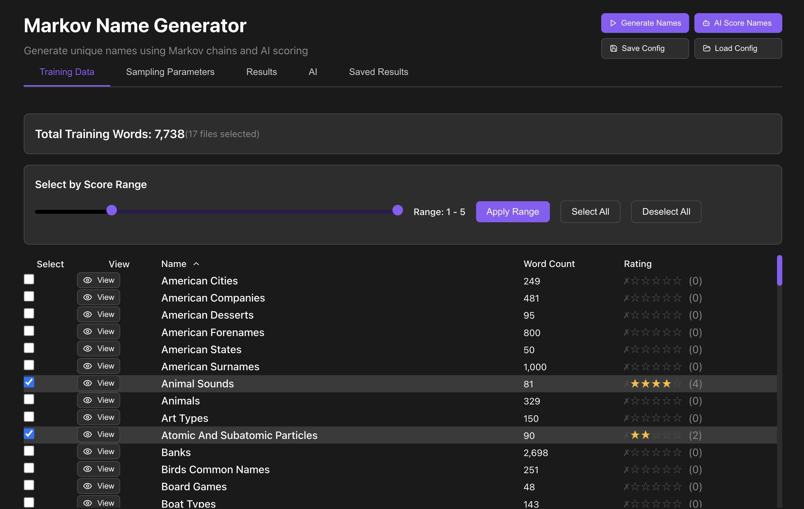
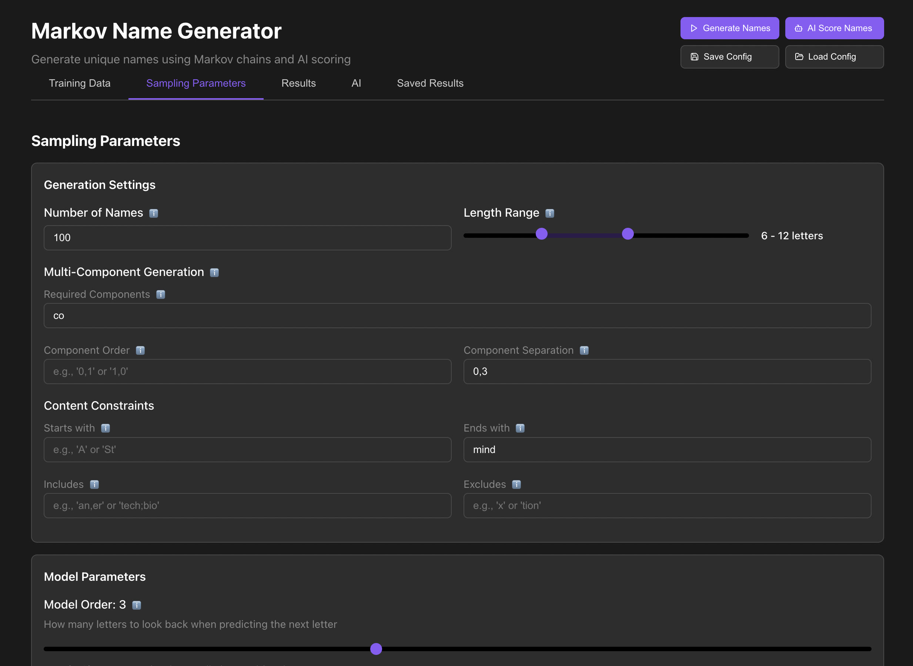
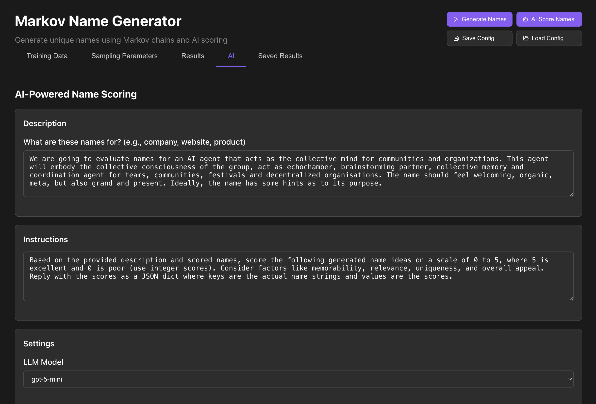

# 🎯 Markov Name Generator

> **Intelligent name generation powered by character n-grams, advanced constraints, and AI scoring**

[](https://python.org)
[](https://reactjs.org)
[](LICENSE)

Transform word lists into endless creative possibilities using statistical learning and intelligent sampling.


<div align="center">
  
</div>

---

## 🚀 What Makes This Special?

This isn't just another random name generator. It's a sophisticated **statistical learning system** that:

- 🧠 **Learns character sequence patterns** from your training words using n-order Markov chains
- 🎛️ **Respects complex constraints** through integrated constraint sampling
- 🤖 **Leverages AI scoring** to rank generated names by quality and relevance based on a natural language description 
- ⚡ **Generates in real-time** with a sleek React interface
- 📊 **Provides 121 curated datasets** covering everything from company names to fantasy creatures

---

## 🔬 The Algorithm Explained

### 🧬 Character N-Gram Learning
```
Training: "apple" → extract trigrams: "##a", "#ap", "app", "ppl", "ple", "le#"
Learning: "##a" → 'p' (100%), "#ap" → 'p' (100%), "app" → 'l' (67%)
```



This system builds **probability distributions** for each character context:

1. **📖 Training Phase**: Extracts n-gram patterns from word lists
   - For order=3: learns 3-character contexts → next character mappings
   - Builds frequency tables: `"app" → ['l':4, 'r':2, 'e':1]`

2. **🔗 Chain Building**: Converts frequencies to probabilities  
   - Applies **temperature scaling** for creativity control
   - Uses **Dirichlet smoothing** to handle unseen contexts

3. **🎲 Markov Sampling**: Generates characters step-by-step
   - Looks at last N characters as context
   - Samples next character from learned distribution
   - Continues until termination character '#'

4. **🔄 Backoff Strategy**: Handles sparse contexts gracefully
   - Falls back to lower-order models when context unseen
   - Ensures robust generation even with limited training data

### ⚡ Constraint-Integrated Generation

Unlike naive "generate-then-filter" approaches, our **constraint sampler** integrates requirements **during generation**:

```python
# Smart constraint handling
starts_with="tech" + ends_with="corp" + length=8-12
# → Guides sampling toward "techcorp", "technicorp", etc.
```

- **Prefix/Suffix Constraints**: Seeds generation with required text
- **Length Bounds**: Terminates generation within specified ranges  
- **Content Filters**: Includes/excludes specific substrings
- **Regex Patterns**: Matches complex structural requirements



### 🤖 AI-Powered Quality Scoring

The integrated `LLMScorer` sends batches of names to language models for intelligent evaluation:

```
Input: "Your task is to score name ideas for a new data startup. Here are my ideas..."
Output: [("techflow", 4.2), ("datacore", 3.8), ("cloudnex", 4.7)]
```



- **Contextual Scoring**: Evaluates names against your specific use case
- **Example Learning**: Uses your rated names to improve scoring
- **Batch Processing**: Efficient API usage with configurable chunk sizes
- **Cost Tracking**: Monitors API usage and expenses

---

## 🎨 Interactive React Interface

Launch the **sleek web GUI** for the full experience:

```bash
# Start React frontend + Python API
python api_server.py &
cd react_gui && npm start
```

**Features:**
- 📊 **Training Data Explorer** - Browse and rate 121 curated word lists
- ⚙️ **Parameter Tuning** - Real-time adjustment of model settings
- 🎯 **Constraint Builder** - Visual constraint configuration
- 📈 **Results Dashboard** - Generate, rate, and export names
- 🤖 **AI Integration** - One-click AI scoring with multiple models

---

## 📚 Rich Training Data (121+ Datasets)

Our curated collection spans diverse domains:

**🏢 Business & Tech**
- `american_companies.txt` - Fortune 500 company names
- `tech_companies.txt` - Startup and tech company names  
- `crypto_coins.txt` - Cryptocurrency and token names

**🌍 Geography & Culture**  
- `american_cities.txt`, `world_cities.txt` - Geographic locations
- `american_forenames.txt`, `world_surnames.txt` - Cultural names

**🎮 Creative & Fantasy**
- `fantasy_creatures.txt` - Mythical beings and monsters
- `sci_fi_terms.txt` - Science fiction vocabulary
- `game_items.txt` - RPG weapons, spells, and artifacts

**🔬 Academic & Scientific**
- `atomic_particles.txt` - Physics terminology
- `medical_terms.txt` - Healthcare vocabulary  
- `programming_languages.txt` - Tech stack names

---

## 🛠️ Quick Start

### 1️⃣ Install Dependencies
```bash
git clone https://github.com/your-username/namegen.git
cd namegen
pip install -r requirements.txt
```

### 2️⃣ Launch the Interface
```bash
# React GUI (recommended)
python api_server.py &
cd react_gui && npm install && npm start

# Or command line
python markov_namegen.py
```

### 3️⃣ Configure Your Model
Edit `config.yaml` or use the web interface:

```yaml
model:
  order: 3              # N-gram size (2-5 recommended)
  temperature: 1.0      # Creativity (0.5=conservative, 2.0=wild)  
  backoff: true         # Handle sparse contexts

generation:
  n_words: 50           # Names to generate
  min_length: 4         # Minimum character count
  max_length: 12        # Maximum character count
  starts_with: "tech"   # Required prefix
  ends_with: ""         # Required suffix
  includes: ""          # Must contain substring  
  excludes: ""          # Cannot contain substring

training_data:
  sources:              # Select from 121+ available datasets
    - "tech_companies.txt"
    - "startups.txt"
```

---

## 🎯 Example Outputs

**Training on `tech_companies.txt` + `startups.txt`:**
```
Generated: techflow, datacore, cloudnex, apibase, devtools, 
           streamify, codeforge, netscale, appvault, digitech
```

**With constraints `starts_with="app"` + `length=6-8`:**  
```
Generated: appflow, appcore, appnex, appbase, appify
```

**AI Scored (context: "mobile app startup"):**
```  
appflow: 4/5 ⭐ "Suggests smooth user experience"
appcore: 4/5 ⭐ "Strong technical foundation vibe"  
appnex: 2/5 ⭐ "Modern but slightly generic"
```

---

## 🧪 Advanced Features

### Multi-Component Generation
Combine different training sources for hybrid names:
```python
components = ["tech_prefixes.txt", "business_suffixes.txt"]
# → "DataCorp", "TechFlow", "CloudBase"
```

### Statistical Analysis  
Built-in metrics for model evaluation:
- **Perplexity scoring** - Model confidence measurement
- **Edit distance filtering** - Similarity to training data
- **N-gram coverage** - Training pattern utilization

### API Integration
REST endpoints for programmatic access:
```bash
curl -X POST http://localhost:5001/api/generate-stream \
  -H "Content-Type: application/json" \
  -d '{"generation": {"n_words": 10, "min_length": 6}}'
```

---

## 📈 Performance & Scalability

- **Fast Training**: Models build in seconds on typical datasets
- **Real-time Generation**: Sub-millisecond name generation  
- **Memory Efficient**: Optimized data structures for large vocabularies
- **Streaming Output**: Progressive results for better UX
- **Caching**: Intelligent model caching prevents redundant computation

---

## 🤝 Contributing

I welcome contributions! Areas of interest:

- 📚 **New datasets** - Add better, domain-specific word lists
- 🧠 **Algorithm improvements** - Better sampling strategies, add a fast word-evaluation model that leverages already scored names.
- 🎨 **UI enhancements** - React component improvements
- 🔧 **Performance optimization** - Faster markov sampling under constraints

---

## 📄 License

MIT License - see [LICENSE](LICENSE) for details.

---

**Ready to generate amazing names?** Star this repo and start creating! ⭐
